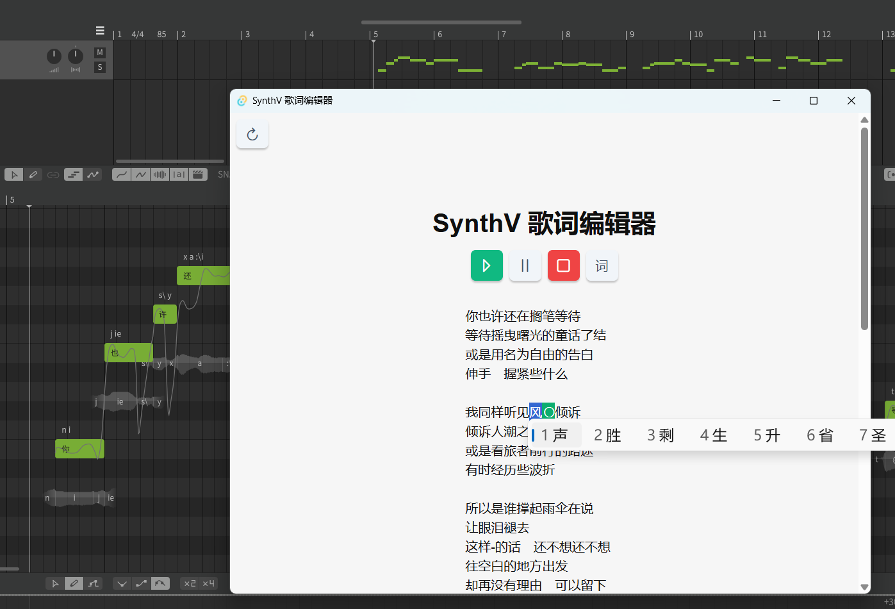

# Synthesizer V 歌词编辑器

对词作友好的 SynthV 歌词/词格编辑器。以词格形式显示、创建和编辑歌词，并实时同步回 SynthV 编辑器，在同一个窗口完成展示 & 试听 & 修改的工作。

## 使用方法

按[安装说明](#安装)安装好程序后，即可开始使用。

本程序有两种编辑模式：编辑词格模式和编辑歌词模式。通过  按钮进行切换。

 在词格模式下，选中歌词后，按：
- `回车键` 可以在该歌词之前增加一个换行
- `空格键` 可以在该歌词之前增加一个空格
- `删除键` 可以将该歌词之前的空格/换行删去

 在歌词模式下，选中歌词后，光标所在位置将变为绿色。直接输入歌词，便可以对歌词进行修改。歌词支持输入中/日/英/+/-符号。

此外：
- 双击某个字可以让 SynthV 的播放条调整到该字之前的位置；
- 通过三个 `播放控制按钮` 可以控制 SynthV 的播放 / 暂停 / 停止。
## 安装

暂时仅支持 Windows，理论上支持 macOS，但目前尚未编译 macOS 版本。如需 macOS 可自行下载编译，或尝试 wine / 提 issue / 联系我。

1. 在 Release 中下载 `SVLyric.exe` 和 `LyricEditService.js` 文件。
2. 将 `LyricEditService.js` 放到 SynthV 的脚本目录。
    - Windows: `文档/Dreamtonics/Synthesizer V Studio/scripts`
    - macOS: `文档/Dreamtonics/Synthesizer V Studio/scripts`
3. 重启 Synthesizer V Studio 或者在菜单栏的 `脚本` 中点击 `重新扫描脚本`
4. 在菜单栏的 `脚本` 中点击 `歌词编辑器后台服务`。
    
    点击之后没有任何窗口弹出，是正常现象。
5. `SVLyric.exe` 所在路径无要求。启动 `SVLyric.exe`，点击窗口内 `获取词格 & 歌词`，即可开始使用。

## 已知问题

- 小狼毫输入法有概率在输入一个词后卡死，请暂时使用其他输入法
- 鼠标操作过快时可能使程序失效，需要重新启动编辑器

## 致谢

- Inspired by: [SV_lyric_editor from 河冰 (@wintercovers)](https://github.com/wintercovers/SV_lyric_editor)
- 技术细节移步 [TechDetails.md](TechDetails.md)

如果您遇到任何问题或有改进建议，欢迎提 issue 或联系 QQ: [872100336@qq.com](mailto:872100336@qq.com)
